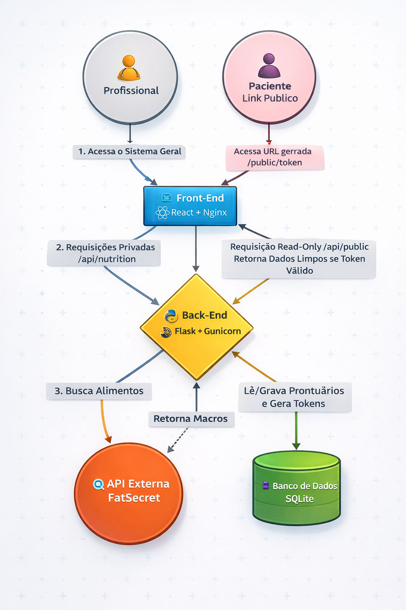

# 🥗 Nutra-se e Evolua - Interface Web (Front-End)

**Nutra-se e Evolua** é uma aplicação Single Page Application (SPA) moderna, focada na visualização intuitiva de prontuários nutricionais e acompanhamento de metas corporais. Desenvolvida em React, a interface prioriza a clareza dos dados e a rapidez na tomada de decisão do profissional de saúde.

> ⚠️ **Aviso:** Esta é a interface visual do projeto. Para que os dados sejam exibidos e salvos, é obrigatório que o [Servidor Back-End](link-do-seu-repo-backend) esteja em execução.

## 📋 Índice

- [Objetivo](#-objetivo)
- [Como o Sistema Funciona (Visão do Usuário)](#️-como-o-sistema-funciona-visão-do-usuário)
- [Tecnologias de Interface e Servidor Web](#-tecnologias-de-interface-e-servidor-web)
- [Fluxograma de Arquitetura](#-fluxograma-de-arquitetura)
- [Integração FatSecret (Consumo de Dados)](#-integração-fatsecret-consumo-de-dados)
- [API FatSecret](#-api-fatsecret)
- [Estrutura do Projeto](#-estrutura-do-projeto)
- [Instalação Local](#-instalação-local)

## 🎯 Objetivo

Fornecer uma interface centralizada e responsiva que elimine a necessidade de planilhas manuais. O sistema permite que nutricionistas visualizem a evolução de seus pacientes através de dashboards dinâmicos e montem planos alimentares baseados em uma base de dados global e confiável.

## ⚙️ Como o Sistema Funciona (Visão do Usuário)

1. **Dashboard de Prontuários:** O profissional visualiza a lista de pacientes e acessa detalhes individuais. O sistema utiliza máscaras inteligentes de input para garantir que dados antropométricos (peso e altura) sejam inseridos com precisão decimal.
2. **Visualização de Evolução:** Novas avaliações físicas são transformadas em gráficos de linha interativos, permitindo comparar o progresso do paciente ao longo dos meses de forma visual.
3. **Plano Alimentar Dinâmico:** Através da integração com a API FatSecret, o profissional pesquisa alimentos e vê instantaneamente as calorias e macros, adicionando-os à dieta com um clique.
4. **Portal do Paciente:** O sistema gera tokens UUID exclusivos para compartilhamento. O paciente recebe um link e visualiza seu progresso e dieta em uma versão "read-only" (somente leitura), sem necessidade de criar conta ou senha.

## 🚀 Tecnologias de Interface e Servidor Web

- **React & Vite:** Framework para construção da interface e ferramenta de build de alta performance.
- **Recharts:** Biblioteca responsável pela renderização dos gráficos de evolução de peso e gordura.
- **Nginx (Produção):** No ambiente de produção (via Docker), utilizamos o **Nginx**. Ele atua como um servidor web de alta performance que entrega os arquivos estáticos do React para o navegador, lidando com o roteamento interno da SPA e garantindo que o carregamento das páginas seja instantâneo.
- **React Router DOM:** Gerencia a navegação entre a área de gestão privada e as páginas públicas de acesso aos pacientes.

## 📂 Fluxograma de Arquitetura

<p align="center">
  
</p>

## 🌐 Integração FatSecret (Consumo de Dados)

Embora a autenticação com a FatSecret ocorra no Back-End por segurança, o Front-End é o responsável por:
- Enviar as solicitações de busca via campos de texto.
- Processar a lista de resultados retornada pelo proxy do servidor.
- Exibir os macronutrientes (Proteínas, Carbos e Gorduras) de forma tabular para o profissional.

> ⚠️ **Nota:** A busca de alimentos só retornará resultados se o seu IP público estiver devidamente cadastrado no painel do [FatSecret Developer](https://platform.fatsecret.com/).

## 📂 API FatSecret

Para executar o projeto completo e fazer as buscas funcionarem na sua máquina local, é obrigatório realizar as configurações abaixo na sua API Back-End:

1. **Cadastro de Desenvolvedor:** Crie uma conta gratuita no portal [FatSecret Developer](https://platform.fatsecret.com/) para obter as chaves de acesso (`Client ID` e `Client Secret`).
2. **Variáveis de Ambiente:** Insira essas chaves no arquivo `.env` do seu servidor Back-End.
3. **Liberação de IP (OBRIGATÓRIO):** A API do FatSecret possui um bloqueio de segurança rigoroso por IP. Para que suas buscas funcionem, você deve ir no painel do FatSecret e **cadastrar o endereço IP público da sua máquina**.

## 📂 Estrutura do Projeto

A estrutura de arquivos foi organizada para maximizar a reutilização de componentes:

```bash
project-nutrition/
├── public/              # Arquivos estáticos puros
├── src/
│   ├── assets/          # Ícones e imagens
│   ├── components/      # Componentes Reutilizáveis
│   │   ├── BackToTop.jsx
│   │   ├── Breadcrumb.jsx
│   │   ├── CardNutrition.jsx
│   │   ├── DefaultLayout.jsx       # Moldura Base (Header/Footer)
│   │   ├── Footer.jsx
│   │   ├── GraficosEvolucao.jsx    # Módulo de Recharts
│   │   ├── Header.jsx
│   │   ├── ImageSkeleton.jsx       # UX de carregamento
│   │   ├── PacienteInfoCard.jsx
│   │   ├── PlanoAlimentar.jsx
│   │   ├── SkeletonCard.jsx        # UX de carregamento
│   │   └── WorkoutRecommendation.jsx
│   ├── pages/           # Views Principais
│   │   ├── Alimentos.jsx           # Busca no FatSecret
│   │   ├── DetalhesPaciente.jsx    # Prontuário Completo
│   │   ├── Gestao.jsx              # Tabela e Formulário de Cadastro
│   │   ├── Home.jsx
│   │   ├── NotFound.jsx
│   │   └── PublicPaciente.jsx      # View Somente-Leitura (Links Compartilhados)
│   ├── App.jsx          # Sistema de Roteamento
│   ├── index.css        # Estilização Global
│   └── main.jsx         # Ponto de Entrada React
├── docker-compose.yml   # Orquestração Docker
├── DOCKER.md            # Documentação técnica da imagem
├── Dockerfile           # Build Multi-estágio
├── package.json
└── README.md
```

## 🔧 Instalação Local

1. **Acesse a pasta:**
   ```bash
   cd project-nutrition
   ```

2. Configure as variáveis de ambiente: Crie um arquivo .env na raiz do projeto com o seguinte conteúdo:
 ```bash
VITE_API_URL=http://localhost:5000
 ```

3. Instale as dependências:
 ```bash
npm install
 ```

4. Inicie o servidor:
 ```bash
npm run dev
 ```
